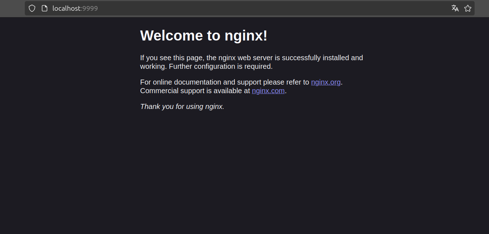

# I. Init

## 1. 1. Installation de Docker
## 2. Vérifier que Docker est bien là

``` 
solar@ROGMAXG14:~$ docker

Usage:  docker [OPTIONS] COMMAND

A self-sufficient runtime for containers

Common Commands:
  run         Create and run a new container from an image
  exec        Execute a command in a running container
  ps          List containers
  build       Build an image from a Dockerfile
  pull        Download an image from a registry
  push        Upload an image to a registry
  images      List images
  login       Authenticate to a registry
  logout      Log out from a registry
  search      Search Docker Hub for images
  version     Show the Docker version information
  info        Display system-wide information

Management Commands:
  builder     Manage builds
  buildx*     Docker Buildx
  compose*    Docker Compose
  container   Manage containers
  context     Manage contexts
  image       Manage images
  manifest    Manage Docker image manifests and manifest lists
  network     Manage networks
  plugin      Manage plugins
  system      Manage Docker
  trust       Manage trust on Docker images
  volume      Manage volumes

Swarm Commands:
  swarm       Manage Swarm

Commands:
  attach      Attach local standard input, output, and error streams to a running container
  commit      Create a new image from a container's changes
  cp          Copy files/folders between a container and the local filesystem
  create      Create a new container
  diff        Inspect changes to files or directories on a container's filesystem
  events      Get real time events from the server
  export      Export a container's filesystem as a tar archive
  history     Show the history of an image
  import      Import the contents from a tarball to create a filesystem image
  inspect     Return low-level information on Docker objects
  kill        Kill one or more running containers
  load        Load an image from a tar archive or STDIN
  logs        Fetch the logs of a container
  pause       Pause all processes within one or more containers
  port        List port mappings or a specific mapping for the container
  rename      Rename a container
  restart     Restart one or more containers
  rm          Remove one or more containers
  rmi         Remove one or more images
  save        Save one or more images to a tar archive (streamed to STDOUT by default)
  start       Start one or more stopped containers
  stats       Display a live stream of container(s) resource usage statistics
  stop        Stop one or more running containers
  tag         Create a tag TARGET_IMAGE that refers to SOURCE_IMAGE
  top         Display the running processes of a container
  unpause     Unpause all processes within one or more containers
  update      Update configuration of one or more containers
  wait        Block until one or more containers stop, then print their exit codes

Global Options:
      --config string      Location of client config files (default "/home/solar/.docker")
  -c, --context string     Name of the context to use to connect to the daemon (overrides DOCKER_HOST env var and default context set with "docker
                           context use")
  -D, --debug              Enable debug mode
  -H, --host list          Daemon socket to connect to
  -l, --log-level string   Set the logging level ("debug", "info", "warn", "error", "fatal") (default "info")
      --tls                Use TLS; implied by --tlsverify
      --tlscacert string   Trust certs signed only by this CA (default "/home/solar/.docker/ca.pem")
      --tlscert string     Path to TLS certificate file (default "/home/solar/.docker/cert.pem")
      --tlskey string      Path to TLS key file (default "/home/solar/.docker/key.pem")
      --tlsverify          Use TLS and verify the remote
  -v, --version            Print version information and quit

Run 'docker COMMAND --help' for more information on a command.
```

## 3. sudo c pa bo (réel)

```
solar@ROGMAXG14:~$ sudo usermod -aG docker $USER
```

```
solar@ROGMAXG14:~$ dk ps

CONTAINER ID   IMAGE     COMMAND                  CREATED          STATUS          PORTS                                     NAMES
0846bce66b85   nginx     "/docker-entrypoint.…"   26 minutes ago   Up 26 minutes   0.0.0.0:9999->80/tcp, [::]:9999->80/tcp   quirky_dubinsky
```


## 4. Un premier conteneur en vif


🌞 Lancer un conteneur NGINX

```
solar@ROGMAXG14:~$ dk run -d -p 9999:80 nginx

Unable to find image 'nginx:latest' locally
latest: Pulling from library/nginx
bc0965b23a04: Pull complete 
650ee30bbe5e: Pull complete 
8cc1569e58f5: Pull complete 
362f35df001b: Pull complete 
13e320bf29cd: Pull complete 
7b50399908e1: Pull complete 
57b64962dd94: Pull complete 
Digest: sha256:fb197595ebe76b9c0c14ab68159fd3c08bd067ec62300583543f0ebda353b5be
Status: Downloaded newer image for nginx:latest
0846bce66b850875a32e6c1c53231a0ef69c3b92f5ffa84e2339f6957728acb2
```

🌞 Visitons
```
solar@ROGMAXG14:~$ dk ps -a

CONTAINER ID   IMAGE     COMMAND                  CREATED          STATUS          PORTS                                     NAMES
0846bce66b85   nginx     "/docker-entrypoint.…"   28 minutes ago   Up 28 minutes   0.0.0.0:9999->80/tcp, [::]:9999->80/tcp   quirky_dubinsky
```

```
solar@ROGMAXG14:~$ dk logs 0846bce66b85

/docker-entrypoint.sh: /docker-entrypoint.d/ is not empty, will attempt to perform configuration
/docker-entrypoint.sh: Looking for shell scripts in /docker-entrypoint.d/
/docker-entrypoint.sh: Launching /docker-entrypoint.d/10-listen-on-ipv6-by-default.sh
10-listen-on-ipv6-by-default.sh: info: Getting the checksum of /etc/nginx/conf.d/default.conf
10-listen-on-ipv6-by-default.sh: info: Enabled listen on IPv6 in /etc/nginx/conf.d/default.conf
/docker-entrypoint.sh: Sourcing /docker-entrypoint.d/15-local-resolvers.envsh
/docker-entrypoint.sh: Launching /docker-entrypoint.d/20-envsubst-on-templates.sh
/docker-entrypoint.sh: Launching /docker-entrypoint.d/30-tune-worker-processes.sh
/docker-entrypoint.sh: Configuration complete; ready for start up
2024/12/12 13:45:12 [notice] 1#1: using the "epoll" event method
2024/12/12 13:45:12 [notice] 1#1: nginx/1.27.3
2024/12/12 13:45:12 [notice] 1#1: built by gcc 12.2.0 (Debian 12.2.0-14) 
2024/12/12 13:45:12 [notice] 1#1: OS: Linux 6.8.0-49-generic
2024/12/12 13:45:12 [notice] 1#1: getrlimit(RLIMIT_NOFILE): 1048576:1048576
2024/12/12 13:45:12 [notice] 1#1: start worker processes
2024/12/12 13:45:12 [notice] 1#1: start worker process 29
2024/12/12 13:45:12 [notice] 1#1: start worker process 30
2024/12/12 13:45:12 [notice] 1#1: start worker process 31
2024/12/12 13:45:12 [notice] 1#1: start worker process 32
2024/12/12 13:45:12 [notice] 1#1: start worker process 33
2024/12/12 13:45:12 [notice] 1#1: start worker process 34
2024/12/12 13:45:12 [notice] 1#1: start worker process 35
2024/12/12 13:45:12 [notice] 1#1: start worker process 36
2024/12/12 13:45:12 [notice] 1#1: start worker process 37
2024/12/12 13:45:12 [notice] 1#1: start worker process 38
2024/12/12 13:45:12 [notice] 1#1: start worker process 39
2024/12/12 13:45:12 [notice] 1#1: start worker process 40
2024/12/12 13:45:12 [notice] 1#1: start worker process 41
2024/12/12 13:45:12 [notice] 1#1: start worker process 42
2024/12/12 13:45:12 [notice] 1#1: start worker process 43
2024/12/12 13:45:12 [notice] 1#1: start worker process 44
```

```
solar@ROGMAXG14:~$ docker inspect 0846bce66b85

[
    {
        "Id": "0846bce66b850875a32e6c1c53231a0ef69c3b92f5ffa84e2339f6957728acb2",
        "Created": "2024-12-12T13:45:12.513439807Z",
        "Path": "/docker-entrypoint.sh",
        "Args": [
            "nginx",
            "-g",
            "daemon off;"
        ],
        "State": {
            "Status": "running",
            "Running": true,
            "Paused": false,
            "Restarting": false,
            "OOMKilled": false,
            "Dead": false,
            "Pid": 6385,
            "ExitCode": 0,
            "Error": "",
            "StartedAt": "2024-12-12T13:45:12.691812743Z",
            "FinishedAt": "0001-01-01T00:00:00Z"
        },
        "Image": "sha256:66f8bdd3810c96dc5c28aec39583af731b34a2cd99471530f53c8794ed5b423e",
        "ResolvConfPath": "/var/lib/docker/containers/0846bce66b850875a32e6c1c53231a0ef69c3b92f5ffa84e2339f6957728acb2/resolv.conf",
        "HostnamePath": "/var/lib/docker/containers/0846bce66b850875a32e6c1c53231a0ef69c3b92f5ffa84e2339f6957728acb2/hostname",
        "HostsPath": "/var/lib/docker/containers/0846bce66b850875a32e6c1c53231a0ef69c3b92f5ffa84e2339f6957728acb2/hosts",
        "LogPath": "/var/lib/docker/containers/0846bce66b850875a32e6c1c53231a0ef69c3b92f5ffa84e2339f6957728acb2/0846bce66b850875a32e6c1c53231a0ef69c3b92f5ffa84e2339f6957728acb2-json.log",
        "Name": "/quirky_dubinsky",
        "RestartCount": 0,
        "Driver": "overlay2",
        "Platform": "linux",
        "MountLabel": "",
        "ProcessLabel": "",
        "AppArmorProfile": "docker-default",
        "ExecIDs": null,
        "HostConfig": {
            "Binds": null,
            "ContainerIDFile": "",
            "LogConfig": {
                "Type": "json-file",
                "Config": {}
            },
            "NetworkMode": "bridge",
            "PortBindings": {
                "80/tcp": [
                    {
                        "HostIp": "",
                        "HostPort": "9999"
                    }
                ]
            },
            "RestartPolicy": {
                "Name": "no",
                "MaximumRetryCount": 0
            },
            "AutoRemove": false,
            "VolumeDriver": "",
            "VolumesFrom": null,
            "ConsoleSize": [
                38,
                158
            ],
            "CapAdd": null,
            "CapDrop": null,
            "CgroupnsMode": "private",
            "Dns": [],
            "DnsOptions": [],
            "DnsSearch": [],
            "ExtraHosts": null,
            "GroupAdd": null,
            "IpcMode": "private",
            "Cgroup": "",
            "Links": null,
            "OomScoreAdj": 0,
            "PidMode": "",
            "Privileged": false,
            "PublishAllPorts": false,
            "ReadonlyRootfs": false,
            "SecurityOpt": null,
            "UTSMode": "",
            "UsernsMode": "",
            "ShmSize": 67108864,
            "Runtime": "runc",
            "Isolation": "",
            "CpuShares": 0,
            "Memory": 0,
            "NanoCpus": 0,
            "CgroupParent": "",
            "BlkioWeight": 0,
            "BlkioWeightDevice": [],
            "BlkioDeviceReadBps": [],
            "BlkioDeviceWriteBps": [],
            "BlkioDeviceReadIOps": [],
            "BlkioDeviceWriteIOps": [],
            "CpuPeriod": 0,
            "CpuQuota": 0,
            "CpuRealtimePeriod": 0,
            "CpuRealtimeRuntime": 0,
            "CpusetCpus": "",
            "CpusetMems": "",
            "Devices": [],
            "DeviceCgroupRules": null,
            "DeviceRequests": null,
            "MemoryReservation": 0,
            "MemorySwap": 0,
            "MemorySwappiness": null,
            "OomKillDisable": null,
            "PidsLimit": null,
            "Ulimits": [],
            "CpuCount": 0,
            "CpuPercent": 0,
            "IOMaximumIOps": 0,
            "IOMaximumBandwidth": 0,
            "MaskedPaths": [
                "/proc/asound",
                "/proc/acpi",
                "/proc/kcore",
                "/proc/keys",
                "/proc/latency_stats",
                "/proc/timer_list",
                "/proc/timer_stats",
                "/proc/sched_debug",
                "/proc/scsi",
                "/sys/firmware",
                "/sys/devices/virtual/powercap"
            ],
            "ReadonlyPaths": [
                "/proc/bus",
                "/proc/fs",
                "/proc/irq",
                "/proc/sys",
                "/proc/sysrq-trigger"
            ]
        },
        "GraphDriver": {
            "Data": {
                "LowerDir": "/var/lib/docker/overlay2/da5a51f937f1c2dbca77b29db42bc3677d36815483cfef8462eb44eaacf8c10e-init/diff:/var/lib/docker/overlay2/d67a9c0d508b15ad2d9ba0112c7fbf1dadde5a3183a0594ecd87aa73042dd3ae/diff:/var/lib/docker/overlay2/9898e0a92134d31b0204992e9185960f466bd5d08654d6da09f38d8d052e73e7/diff:/var/lib/docker/overlay2/646bc2ecb2ad260b1d252790c0ca302e127605326ebe46701eba3f9df238c36d/diff:/var/lib/docker/overlay2/890d1124002910806e749e19105ae8e725c2a58368418fba6ba3342d4cc15ea0/diff:/var/lib/docker/overlay2/2906dd81902db8454156380073300325ab5769740f9c0047d9006bbdb3cf1678/diff:/var/lib/docker/overlay2/e883a4577a4bc06366e02115a3b0681f38f5fb1135f18ab6fae60f0b6f9b0f3b/diff:/var/lib/docker/overlay2/293dabd2ee55993ce6202338141b6239e1e002cb094576f1a7120c619016bda4/diff",
                "MergedDir": "/var/lib/docker/overlay2/da5a51f937f1c2dbca77b29db42bc3677d36815483cfef8462eb44eaacf8c10e/merged",
                "UpperDir": "/var/lib/docker/overlay2/da5a51f937f1c2dbca77b29db42bc3677d36815483cfef8462eb44eaacf8c10e/diff",
                "WorkDir": "/var/lib/docker/overlay2/da5a51f937f1c2dbca77b29db42bc3677d36815483cfef8462eb44eaacf8c10e/work"
            },
            "Name": "overlay2"
        },
        "Mounts": [],
        "Config": {
            "Hostname": "0846bce66b85",
            "Domainname": "",
            "User": "",
            "AttachStdin": false,
            "AttachStdout": false,
            "AttachStderr": false,
            "ExposedPorts": {
                "80/tcp": {}
            },
            "Tty": false,
            "OpenStdin": false,
            "StdinOnce": false,
            "Env": [
                "PATH=/usr/local/sbin:/usr/local/bin:/usr/sbin:/usr/bin:/sbin:/bin",
                "NGINX_VERSION=1.27.3",
                "NJS_VERSION=0.8.7",
                "NJS_RELEASE=1~bookworm",
                "PKG_RELEASE=1~bookworm",
                "DYNPKG_RELEASE=1~bookworm"
            ],
            "Cmd": [
                "nginx",
                "-g",
                "daemon off;"
            ],
            "Image": "nginx",
            "Volumes": null,
            "WorkingDir": "",
            "Entrypoint": [
                "/docker-entrypoint.sh"
            ],
            "OnBuild": null,
            "Labels": {
                "maintainer": "NGINX Docker Maintainers <docker-maint@nginx.com>"
            },
            "StopSignal": "SIGQUIT"
        },
        "NetworkSettings": {
            "Bridge": "",
            "SandboxID": "9f8294ae391dcf8b4a9111d1aaba86b799deea39485360f1d5a9e3b3bd902786",
            "SandboxKey": "/var/run/docker/netns/9f8294ae391d",
            "Ports": {
                "80/tcp": [
                    {
                        "HostIp": "0.0.0.0",
                        "HostPort": "9999"
                    },
                    {
                        "HostIp": "::",
                        "HostPort": "9999"
                    }
                ]
            },
            "HairpinMode": false,
            "LinkLocalIPv6Address": "",
            "LinkLocalIPv6PrefixLen": 0,
            "SecondaryIPAddresses": null,
            "SecondaryIPv6Addresses": null,
            "EndpointID": "3a096bfdade6bdb1b08cd390cc95e4dd7ac620586d2cc83e409b6701316648a2",
            "Gateway": "172.17.0.1",
            "GlobalIPv6Address": "",
            "GlobalIPv6PrefixLen": 0,
            "IPAddress": "172.17.0.2",
            "IPPrefixLen": 16,
            "IPv6Gateway": "",
            "MacAddress": "02:42:ac:11:00:02",
            "Networks": {
                "bridge": {
                    "IPAMConfig": null,
                    "Links": null,
                    "Aliases": null,
                    "MacAddress": "02:42:ac:11:00:02",
                    "DriverOpts": null,
                    "NetworkID": "d072844cdf8ecd36267f716aa74401ae2a4701494052c5c7f2806ff8643815b5",
                    "EndpointID": "3a096bfdade6bdb1b08cd390cc95e4dd7ac620586d2cc83e409b6701316648a2",
                    "Gateway": "172.17.0.1",
                    "IPAddress": "172.17.0.2",
                    "IPPrefixLen": 16,
                    "IPv6Gateway": "",
                    "GlobalIPv6Address": "",
                    "GlobalIPv6PrefixLen": 0,
                    "DNSNames": null
                }
            }
        }
    }
]
```

```
solar@ROGMAXG14:~$ sudo ss -lnpt

LISTEN        0             4096                       0.0.0.0:9999                    0.0.0.0:*            users:(("docker-proxy",pid=6307,fd=4)) 

LISTEN        0             4096                          [::]:9999                       [::]:*            users:(("docker-proxy",pid=6334,fd=4))  
```

```
solar@ROGMAXG14:~$ sudo ufw allow 9999
```



🌞 On va ajouter un site Web au conteneur NGINX

```
solar@ROGMAXG14:~/nginx$ dk ps
CONTAINER ID   IMAGE     COMMAND                  CREATED          STATUS          PORTS                                                 NAMES
a9f938f06ee2   nginx     "/docker-entrypoint.…"   57 seconds ago   Up 56 seconds   80/tcp, 0.0.0.0:9999->8080/tcp, [::]:9999->8080/tcp   bold_germain
```

```
solar@ROGMAXG14:~/nginx$ curl localhost:9999

<h1>MEOOOW</h1>
```

## 5. Un deuxième conteneur en vif

🌞 Lance un conteneur Python, avec un shell

```
solar@ROGMAXG14:~/nginx$ docker run -it python bash

root@98ed2755060e:/# pip install aiohttp

Successfully installed aiohappyeyeballs-2.4.4 aiohttp-3.11.10 aiosignal-1.3.1 attrs-24.2.0 frozenlist-1.5.0 idna-3.10 multidict-6.1.0 propcache-0.2.1 yarl-1.18.3

root@98ed2755060e:/# pip install aioconsole

>>>

>>> import aiohttp

```